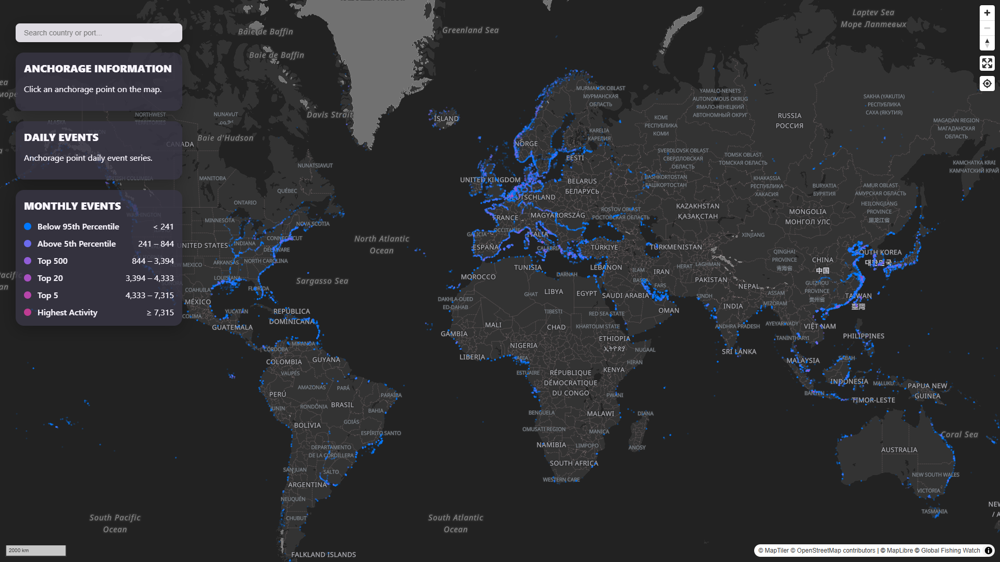

# Global Fishing Watch Vessel Voyages and Anchorages Analysis and Web Map



## The question

**What are the main characteristics of the global maritime supply chain?**

This question is desegregated in five major questions to address the spatial distribution of anchorage points and the amount vessels visits.

1. What is the global spatial distribution of ports, docks and anchorage points?

2. How frequently are anchorage points visited by vessels?

3. What is the daily intensity of vwssel activity at each anchorage point?

4. How does daily vessel activity vary at each anchorage point during the month?

5. Which anchorage points, ports, and countries concentrate the highest vessel activity?

- Where are the anchorage points below the 95th Percentile?
- Where are located the anchorage points above the 95th Percentile ?
- Where are the Top 500 anchorage points ?
- Where are the Top 20 anchorage points?
- Where are the Top 5 anchorage points?
- Where is the anchorage point with the highest activity?


## The data

- **Anchorage Points:** `named_anchorages_v2_pipe_v3_202601.csv` 
<br> Global Fishing Watch. 2026. Anchorages Version 3. Data set accessed 2026-07-05.
- **Vessels Voyages:** `voyages_c4_pipe_v3_202606.csv` 
<br> Global Fishing Watch. 2026, updated monthly. Voyages - confidence level 4 - AIS data pipieline v4. Data set accessed 2026-07-05.


## Methodology

Built the exploratory analysis, data transformation, processing, and delivery of ready-for-web map data with **Python Pandas and GeoPandas** as showned in the `ETL-anchorages-voyages-v4.ipynb`.

The anchorages dataset was transformed to show only relevant information, such as the label, unique identifier, associated country, and dock classification. The anchorage dataset was also enriched to include the full name of the Exclusive Economic Zone (EEZ) containing each point.

The Vessel Voyages dataset was transformed to list vessel visits to the anchorage points during June 2026, as it was the month with the highest number of recorded visits. A daily time-series of visit was also generated from this dataset, as well as an aggregated metric to measure the intensity of use for each anchorage point.

An spatial search index was built using the EEZ and port names listed in the dataset, which is used in the web map.

The anchorage spatial dataset was converted into a `PMTiles` format which makes it possible to display the large number of records at global scale. The Jupyter Notebook deliver `JSON` files that are displayed in the web map. The following are the files loaded into the web map:

- `data.pmtiles` contains the anchorage points information in a map tile format
- `metadata.json` contains the vessel visits timeframe.
- `searchIndex.json` contains a list of countries and ports bounding boxes around the anchorage points, which is used by the web map search bar.
- `timeSeries.json` contains the daily vessel visits per anchorage point during the given timeframe.


## Findings

For the June 2026 time period:

- The most visited anchorage point was located in the Port of Shanghai. It received 7,315 vessels.
- 95% of the anchorage point had fewer than 241 vessel visits. Most of them had just one.
- The top 5 most visited anchorage points are located in China, Indonesia, Netherlands and New Zealand.

| s2id     | Port       | Country               | month visits |
|----------|------------|------------------------------|-------| 
| 35ad9741 | Shanghai   | China                        | 7,315 |
| 35adc0e7 | Shanghai   | China                        | 4,859 |
| 2e417513 | Bakauheni  | Indonesia                    | 4,839 |
| 47c480bd | NLD-460    | Netherlands (Kingdom of the) | 4,518 |
| 6d0d482d | Orakei     | New Zealand                  | 4,334 |

- The top 5 most visited ports are the ports of Shangai, Antwerp, Busan, Incheon, and Ningbo. The port of Shangai handled 7.79% of  China's vessel visits and 0.77% of the world's vessel visits. Antwerp (Belgium) handled the 46.9% of Belgium's vessel visits and the 0.37% of the world's vessel visits.

| Port      | Country             | month visits |
|-----------|---------------------------|--------| 
| Shanghai  | China                     | 23,364 |
| Antwerp   | Belgium                   | 11,132 |
| Busan     | Indonesia                 | 10,185 |
| Incheon   | Korea (the Republic of)   | 9,580  |
| Ningbo    | Korea (the Republic of)   | 9,075  |

- The top 5 countries with more visits are China, US, Norway, Italy and France. China handled 9.95% and US handled the 9.61% of the vessel visits across the globe.

| Country                      | month visits |
|-----------------------------------|---------| 
| China                             | 300,052 |
| United States of America (the)    | 289,740 |
| Norway                            | 207,166 |
| Italy                             | 148,483 |
| France                            | 127,049 |

## How to run it

### Set project environment
Run: 

```bash
make env
```

### Run the analysis with Jupyter Notebook
Set kernel from this project environment

```bash
make set-kernel
```

Open `ETL-anchorages-voyages-v4.ipynb` and run the code to calculate each result, plots, and return a GeJSON file that has to be converted to pmtiles and JSON files.

### Convert GeoJSON to PMtiles

Run

```bash
make pmtiles-data
```

### Run the Web Map
Make sure the the folder `./docs/data/` has the following files:
- data.pmtiles
- metadata.json
- searchIndex.json
- timeSeries.json
- map_style_smooth_dark.json

The `map_style_smooth_dark.json` file is a custom map style based on Stadia Maps Alidade Smooth Dark style but without the propietary fonts or gliphs. Feel free to use it or other style.

Serve the `docs` folder using a local web server:

```bash
python -m http.server
```

http://localhost:8000


## Web map features

✅ Search for countries and ports <br>
✅ View search suggestions while typing <br>
✅ Navigate to geographic areas <br>
✅ Explore anchorage locations interactively <br>
✅ Interact through mouse hover and touch selection <br>
✅ Highlight selected features <br>
✅ Automatically zoom to selected points <br>
✅ View port and country attributes <br>
✅ Explore historical activity through line graphs <br>
✅ Analyze vessel activity trends by anchorage point <br>
✅ View dataset temporal coverage <br>
✅ Reset the interface after exploration <br>
✅ Use the application on desktop and smartphone screens (≤600 px) <br>
✅ Interact through mouse or touch controls <br>


## What I learned

- Set up a reproducible project environment that allows running
the ETL pipeline, and Jupyter Notebook.
- Set up a ETL pipeline from a data portal that delivers ready-to-use data with a tile format that host large dataset that would not be possible to display in other formats.
- Prepared a Jupyter Notebook with basic spatial EDA that reports two spatial metrics and visualize them with a web maps.
- Web mapping provides scalable solutions capable of handling large datasets when the architecture is designed accordingly.
- Dividing the Java Script functionality into module makes the app easy to navigate, fix, and improve.
- Web mapping design has to consider the desktop and the mobile responsive version.
- Cartographic design principles always applies rather the map is static or interactive.


## Stack

- **Environment** : Bash + Pixi

- **Data Processing** : Jupyter Lab + Python + Pandas + GeoPandas + Matplotlib

- **Geospatial Processing** : PMTiles + Tippecanoe + GeoJSON

- **Web Development** : HTML + CSS + JavaScript


