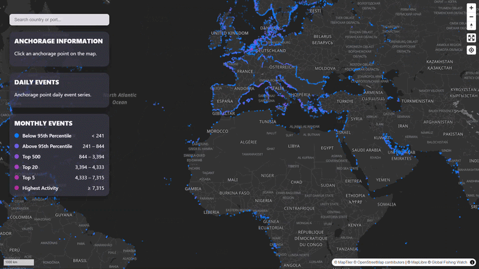
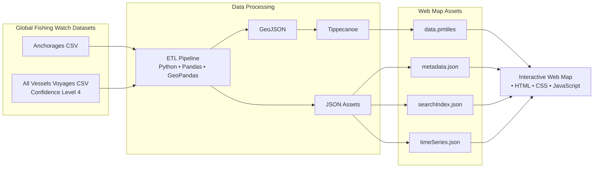
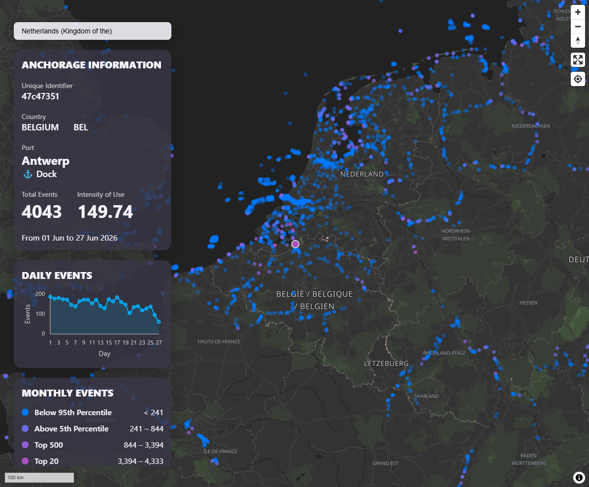
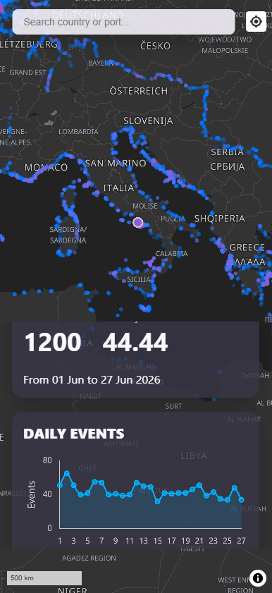

# Global Fishing Watch Vessel Voyages and Anchorages Analysis and Web Map

This project analyzes global vessel voyages activity in anchorage points using Global Fishing Watch data and delivers an interactive web map to explore the results. 



It builds an ETL pipeline that transforms Automatic Identification System (AIS) derived vessel visits into PMTiles and JSON files used by a self-hosted interactive web map for exploring global maritime traffic.

**🌐 Live Demo:** [Open the Interactive Web Map](https://adrianchc.github.io/gfw-anchorages-vessel-activity/)

📖 **ETL & Exploratory Analysis Notebook:** [Open the Jupyter Notebook](https://github.com/AdrianChC/gfw-anchorages-vessel-activity/blob/main/ETL-anchorages-voyages-v4.ipynb)


## Research
### What are the main spatial and temporal characteristics of global maritime activity at anchorage points?

This question is broken down in five major questions to address the spatial distribution of anchorage points and the amount vessels visits.

1. What is the global spatial distribution of ports, docks and anchorage points?

2. How frequently are anchorage points visited by vessels?

3. What is the daily intensity of vessel activity at each anchorage point?

4. How does daily vessel activity vary at each anchorage point during the month?

5. Which anchorage points, ports, and countries concentrate the highest vessel activity?

- Where are the anchorage points below the 95th Percentile?
- Where are located the anchorage points above the 95th Percentile ?
- Where are the Top 500 anchorage points ?
- Where are the Top 20 anchorage points?
- Where are the Top 5 anchorage points?
- Where is the anchorage point with the highest activity?

### The data

- **Anchorage Points:** `named_anchorages_v2_pipe_v3_202601.csv` 
<br> Global Fishing Watch. 2026. Anchorages Version 3. Data set accessed 2026-07-05.
- **Vessels Voyages:** `voyages_c4_pipe_v3_202606.csv` 
<br> Global Fishing Watch. 2026, updated monthly. Voyages - confidence level 4 - AIS data pipieline v4. Data set accessed 2026-07-05.

### Analysis methodology

#### Data Preparation
An exploratory  analysis of the `anchorage points` dataset was conducted to evaluate the available attributes, including port, country, dock, and Exclusive Economic Zone (EEZ) information of each point. This analysis informed the selection of the variables used throughout the study.

The exploratory data analysis of the `vessels activity` dataset was conducted to quantify the distribution of vessel visits on each anchorage point over time. Based on this analysis, June 2026 was selected as the study period because it contained the highest number of recorded visits, providing a relevant timeframe to understand the global maritime activity.

#### Data Enrichment
The country information field `iso3`  from the `anchorage points` dataset was joined with a dataset containing in-detail information of the name of the Exclusive Economic Zone associated with each point.

#### Activity Analysis
The `trip_start_anchorage_id` and `trip_end_anchorage_id` fields from the `vessels activity` dataset were processed to quantify the number of registered visits on each anchorage point. 

The `trip_start` and `trip_end` fields were processed to display daily visits during the June 2026, the aggregated monthly visits, and the daily intensity of use of each anchorage.

#### Statistical Analysis
The monthly visit count were analyzed to identify relevant activity groups. The monthly visit distribution shows a right-skewed pattern, characterized by a rapid decrease in frequency as visit count increased, resembling an exponential decreasing  distribution. 

Based on this pattern, anchorage points were categorized using percentile-based and rank-based thresholds:  below 95th percentile, above the 5th percentile, top 500, top 20, top 5, and the maximum observed value.

### Findings

For the June 2026 time period:

- The most visited anchorage point was located in the Port of Shanghai. It received 7,315 vessels.
- 95% of the anchorage point had fewer than 241 vessel visits. Most of them had just one.
- The top 5 most visited anchorage points are located in China, Indonesia, Netherlands and New Zealand.

| s2id     | Port       | Country               | Month visits |
|----------|------------|------------------------------|-------| 
| 35ad9741 | Shanghai   | China                        | 7,315 |
| 35adc0e7 | Shanghai   | China                        | 4,859 |
| 2e417513 | Bakauheni  | Indonesia                    | 4,839 |
| 47c480bd | NLD-460    | Netherlands (Kingdom of the) | 4,518 |
| 6d0d482d | Orakei     | New Zealand                  | 4,334 |

- The top 5 most visited ports are the ports of Shanghai, Antwerp, Busan, Incheon, and Ningbo. The port of Shanghai handled 7.79% of  China's vessel visits and 0.77% of the world's vessel visits. Antwerp (Belgium) handled the 46.9% of Belgium's vessel visits and the 0.37% of the world's vessel visits.

| Port      | Country             | Month visits |
|-----------|---------------------------|--------| 
| Shanghai  | China                     | 23,364 |
| Antwerp   | Belgium                   | 11,132 |
| Busan     | Korea (the Republic of)   | 10,185 |
| Incheon   | Korea (the Republic of)   | 9,580  |
| Ningbo    | China                     | 9,075  |

- The top 5 countries with more visits are China, US, Norway, Italy and France. China handled 9.95% and US handled the 9.61% of the vessel visits across the globe.

| Country                      | Month visits |
|-----------------------------------|---------| 
| China                             | 300,052 |
| United States of America (the)    | 289,740 |
| Norway                            | 207,166 |
| Italy                             | 148,483 |
| France                            | 127,049 |

- The distribution of the vessel visits during June 2026.

|  Category                | Month visits |
|-----------------------|-------|
| Below 95th Percentile | < 241 |
| Above 95th Percentile | 241 – 844 |
| Top 500               | 844 – 3,394 |
| Top 20                | 3,394 – 4,333 |
| Top 5                 | 4,333 – 7,315 |
| Highest Activity      | ≥ 7,315 |


## Engineering
### Architecture

### Generated Assets

The ETL pipeline produces the following assets consumed by the interactive web map.

| Asset | Purpose |
|--------|---------|
| `data.pmtiles` | Vector tiles containing anchorage locations and attributes. |
| `metadata.json` | Dataset metadata and temporal coverage. |
| `searchIndex.json` | Search index and bounding boxes for ports and countries. |
| `timeSeries.json` | Daily vessel visits for each anchorage point. |

### Repository structure

```text
.
├── data/           
│   ├── raw/        # raw Global Fishing Watch datasets
│   └── processed/  # intermediate GEOJSON outputs
│
├── docs/           # interactive web map (GitHub Pages)
│   ├── css/        
│   ├── data/       # PMTiles and JSON assets
│   ├── js/         
│   └── index.html  
│
├── notebook.ipynb  # ETL pipeline and exploratory analysis
├── Makefile        # project automation
├── pixi.toml       # project environment
├── README.md
│
├── .pixi/             # Generated Pixi environment
└── .venv/             # Python virtual environment
```

### Technology Stack

- **Environment** : Bash + Pixi
- **Data Processing** : Jupyter Lab + Python + Pandas + GeoPandas + Matplotlib
- **Geospatial Processing** : PMTiles + Tippecanoe + GeoJSON
- **Web Development** : HTML + CSS + JavaScript

### How to run

#### Set project environment
Run: 

```bash
make env
```

#### Run the analysis with Jupyter Notebook
Set kernel from this project environment

```bash
make set-kernel
```

Open `ETL-anchorages-voyages-v4.ipynb` and run the code to calculate each result, plots, and return a GeJSON file that has to be converted to pmtiles and JSON files.

#### Convert GeoJSON to PMtiles

Run

```bash
make pmtiles-data
```

#### Run the Web Map
Make sure the the folder `./docs/data/` has the following files:
- data.pmtiles
- metadata.json
- searchIndex.json
- timeSeries.json
- map_style_smooth_dark.json

The `map_style_smooth_dark.json` file is a custom map style based on Stadia Maps Alidade Smooth Dark style but without the propietary fonts or gliphs. Feel free to use it or other style.

Serve the `docs` folder using a local web server:

```bash
python -m http.server
```

http://localhost:8000



### Web Map features

✅ Search for countries and ports <br>
✅ View search suggestions while typing <br>
✅ Navigate to geographic areas <br>
✅ Explore anchorage locations interactively <br>
✅ Interact through mouse hover and touch selection <br>
✅ Highlight selected features <br>
✅ Automatically zoom to selected points <br>
✅ View port and country attributes <br>
✅ Explore historical activity through line graphs <br>
✅ Analyze vessel activity trends by anchorage point <br>
✅ View dataset temporal coverage <br>
✅ Reset the interface after exploration <br>
✅ Use the application on desktop and smartphone screens (≤600 px) <br>
✅ Interact through mouse or touch controls <br>




## What I learned

- Set up a reproducible project environment that allows running
the ETL pipeline, and Jupyter Notebook.
- Set up an ETL pipeline from a data portal that delivers ready-to-use data with a map tile format that host a large dataset which would not be possible in other formats such as GEOJSON.
- Write a Jupyter Notebook that reproduces an ETL process that delivers ready-to-use outputs for web mapping.
- Web maps require low-size files. It is important to have an strategy to deliver data outputs that are optimized for web. JSON file export parameters, identation, primary keys are relevant. 
- The data needs to be structured considering the web map features that are serving.
- Spatial data field is just one aspect of the outputs. Not all data outputs need to include spatial features. 
- Web mapping provides scalable solutions capable of handling large datasets when the architecture is designed accordingly.
- Dividing the Java Script functionality into modules makes the app easy to navigate, fix, and improve.
- Web mapping design has to consider the desktop and the mobile responsive version.
- Cartographic design principles always apply rather the map is static or interactive.


